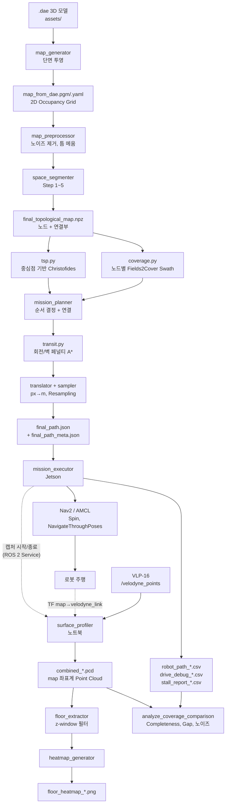

# DAE 기반 커버리지 바닥 평탄도 자율 측정 시스템

[](README.md)
[](README.kr.md)
[](https://docs.ros.org/en/humble/)
[](https://www.python.org/)
[](https://docs.nav2.org/)
[](#라이선스)
[](#로드맵)

**건물의 3D 설계 파일 하나로 바닥 평탄도 전수 검사를 자동화함. 사람이 아파트의 모든 층과 모든 방마다 걸어다닐 필요가 없음.**

`.dae` 건축 모델을 입력받아 2D 맵으로 변환하고, 실내를 방 단위 노드로 분할한 뒤, 전 구역을 빠짐없이 지나는 Coverage Path를 오프라인으로 한 번 생성함. 그 경로를 ROS 2 / Nav2로 자율주행하면서 3D LiDAR로 바닥 Point Cloud를 수집해 mm 단위 평탄도 Heatmap을 만듦.

<p align="center">
  <br>
  <em>최종 산출물: 건물 전체 바닥의 높이 분포. 1&nbsp;cm 분석 격자 기준.</em>
</p>

---

## TL;DR

| | |
|---|---|
| **Problem** | 다세대 건물의 바닥 평탄도 검사는 지금도 사람이 레이저 레벨기를 들고 수동으로 함. 비용이 세대 수에 비례해 선형으로 증가하므로 확장성이 없음. |
| **Input** | 해당 층의 `.dae`(또는 BIM에서 내보낸) 모델 하나. 사전 SLAM 주행도, 수동 Waypoint 지정도 필요 없음. |
| **Output** | 평탄도 Heatmap, 필터링된 바닥 Point Cloud, 실주행 Trajectory, 주행별 Coverage 지표. |
| **Approach** | 오프라인: DAE → 2D 맵 → 위상 분할(Topological Decomposition) → TSP + Fields2Cover + A\* → Waypoint 파일 1개. 온라인: Nav2/AMCL이 그 경로를 따라가는 동안 VLP-16이 바닥을 연속 측정. |
| **Scope** | 개별 구성요소(F2C, TSP, A\*, Nav2)는 기존 기법임. 기여는 이들을 시공 품질검사라는 목적에 맞게 **End-to-End로 통합**하고, 각 설계 선택의 기여도를 ablation으로 분리해 제시한다는 점. |

---

## 문제 인식

바닥 평탄도는 마감 공정의 계약상 인수 기준임. 현장에서 쓰이는 방법은 크게 두 가지:

- **라인레이저 프로파일로미터(Line-Laser Profilometer)** — 정밀도는 실험실급이지만 스마트팩토리 가격대라 일반 주택 현장에는 도입되지 않음.
- **수동 레이저 레벨기** — 저렴해서 널리 쓰이는 방식. 하지만 사람이 방마다 장비를 들고 이동해야 해서 **인력과 시간이 세대 수에 비례해 선형으로 증가**함.

수백 세대가 거의 동일한 평면으로 반복되는 아파트에서는 이 선형 비용이 그대로 병목이 됨. 이 프로젝트는 장비가 아니라 **워크플로 자체**를 바꿈. 사람이 방마다 걷는 대신, 로봇이 미리 계산된 Coverage Path를 따라 전 구역을 돌며 3D LiDAR로 바닥을 측정함.

평면이 반복된다는 점이 핵심임. 비용이 큰 planning 단계를 **설계 파일로부터 오프라인에서 한 번만** 수행하고, 같은 평면의 모든 세대에 재사용함.

## What it does

- **Reads the building, not the site.** `.dae`/BIM 모델을 2D 점유 격자(Occupancy Grid)로 변환하므로 사전 SLAM 매핑 주행이 필요 없음.
- **Decomposes space the way a person would.** 임의의 셀이 아니라 문·구멍·오목한 형상·복도 길이를 기준으로 방 단위 노드를 만듦.
- **Plans full coverage offline.** TSP가 방문 순서를, Fields2Cover가 노드 내부 Swath를, A\*가 노드 간 이동을 담당해 `final_path.json` 하나로 합침.
- **Checks reachability first.** 각 노드의 통과 가능 폭을 LiDAR Blind Radius와 비교해 분류하고, 좁은 방에는 넓은 방과 다른 Swath 전략을 적용함.
- **Drives autonomously.** Nav2 + AMCL을 쓰되, 측정(Coverage) 구간과 이동(Transit) 구간에 서로 다른 Controller를 씀.
- **Measures while moving.** 정지 지점에서만이 아니라 Coverage 구간 전체에서 연속 수집하고, 측정 경계에서는 의도적으로 재통과(Boundary Repass)해 센서의 Blind Cone을 메움.
- **Reports every run.** 매 주행마다 실주행 Trajectory, Stall 진단, Coverage 완전성(Completeness), 평탄도 Heatmap을 남김.
- **Supports ablation.** 5개 최적화 요소가 전부 런타임 토글이라 leave-one-out으로 각각의 기여를 측정할 수 있음.

## 시스템 구성

기기 3대가 역할을 나눠 맡음:

| 역할 | 기기 | 실행 | 온라인 여부 |
|---|---|---|---|
| **planning** | 워크스테이션/노트북 (x86_64) | `run_generation_pipeline.py` | 오프라인, 평면당 1회 |
| **주행** | TurtleBot3 Waffle의 Jetson Orin Nano | `mission_execution.launch.py` + Nav2 | 온라인 |
| **측정** | 노트북, VLP-16 유선 직결 | `surface_profiling.launch.py` | 온라인 |

VLP-16 Point Cloud를 Jetson을 거쳐 보내면 Nav2 통신과 대역폭을 다투므로, 측정은 LiDAR가 직결된 노트북에서 별도로 실행함. 두 노드는 ROS 2 Service 3개(캡처 시작 / 캡처 종료 / 미션 종료)로 협력하고, 공유 타임스탬프로 서로의 산출물을 짝지음.

## 데이터 플로우



로봇이 만드는 모든 산출물은 패키지 **외부의 데이터 저장소**(`~/dae_floor_maps`)에 쌓임. 저장소에는 코드만 남기기 위한 의도적인 분리임. 홈 디렉토리 또는 사용자가 지정한 위치에서 관리하면 됨.

```
~/dae_floor_maps/
├── assets/          # 입력 .dae 모델
├── maps/            # grid/ (2D OGM), topology/ (노드 .npz), debug_image/
├── analytics/       # metrics/ (final_path.json), paths/ (실주행 .csv),
│                    # pointclouds/ (.pcd), logs/ (drive_debug, stall_report)
├── visualization/   # 단계별 디버그 이미지와 평탄도 Heatmap
└── eval_runs/       # 실험별 completeness 스냅샷 (핵심 strategy 실험용)
```

---

## 작동 방식

### 1단계 — 환경 모델링 (오프라인)

`.dae` Mesh를 바닥 높이에서 잘라 2D Occupancy Grid를 만들고, 정리한 뒤 5단계에 걸쳐 노드로 분할함. 각 단계가 디버그 이미지를 남기므로, 분할 오류를 경로 생성 이후가 아니라 해당 단계에서 바로 확인할 수 있음.

| | |
|---|---|
|  |  |
| **입력** — `.dae`에서 변환된 2D 격자. | **Step 1 — 물리적 한계.** 로봇이 주행 가능한 영역과 불가능한 영역을 분리함. 둘 다 측정 대상이고, 도달 가능성만 다름. |
|  |  |
| **Step 2 — 문 기반 분할.** 문 폭에 해당하는 개구부를 찾아 그 지점에서 자름 — 사람이 방을 구분하는 기준과 동일함. 동시에 각 개구부를 로봇이 실제로 통과할 수 있는지도 판정함. | **Step 3 — 구멍 분할.** 기둥·설비 같은 내부 장애물이 있으면 노드가 단순 연결(Simply Connected)이 아니게 되므로, 각 노드가 Coverage 가능한 형태로 남도록 자름. |
|  |  |
| **Step 4 — 오목 영역 분할.** L자 복도 등을 볼록성(Solidity) 기준으로 재귀 분할해, Boustrophedon Swath가 의미를 갖도록 만듦. | **Step 5 — 긴 노드 분할.** 종횡비(Aspect Ratio) 한계를 넘는 노드는 운용 효율을 위해 나눔. |

산출물: `final_topological_map.npz`. 노드 마스크, 중심점, 노드 간 연결 지점(문)을 담음.

### 2단계 — 경로 생성 (오프라인)

<p align="center">
  
  <br>
  <em>왼쪽: Coverage Swath(흰색)와 노드 간 Transit 경로(초록), 그리고 로봇을 놓아야 할 시작 지점 표시. 오른쪽: 같은 경로를 거리 기준으로 Resampling해 실제로 Nav2에 전달되는 Waypoint로 만든 결과.</em>
</p>

1. **폭 분류.** 각 노드의 안전 통과 폭을 측정해 LiDAR Blind Radius 기준으로 `wide`/`narrow`/`ultra_narrow`로 나눔. 노드별 Coverage 전략이 여기서 갈리고, 로봇이 진입할 수 없는 방도 이 단계에서 걸러짐.
2. **방문 순서.** 노드 중심점에 대한 Christofides 근사(OR-Tools)로 전역 순회 순서를 정함.
3. **국소 재정렬.** 허브 복도에 연결된 말단 방(Pendant)들을, 로봇이 허브 Coverage를 실제로 끝내는 지점에서 문이 가까운 순서로 재배열.
4. **노드 내부 Coverage.** Fields2Cover가 Boustrophedon Swath를 생성함. wide 노드는 최적 각도를 자동 탐색하고, narrow 노드는 각도를 고정.
5. **Swath 정렬.** 노드 내 Swath 순서를 진입 문 근처에서 시작해 다음 방의 문 근처에서 끝나도록 맞춤.
6. **노드 간 이동.** 회전 페널티와 벽 근접 페널티를 명시적으로 준 A\*로 연결한 뒤, Douglas–Peucker로 격자 A\* 특유의 계단 현상(Staircase Artifact)을 제거함.
7. **내보내기.** 픽셀 좌표를 미터로 변환하고 일정 간격으로 Resampling해 `final_path.json`으로 저장함. planning 시점에 실제로 쓴 파라미터를 기록한 `final_path_meta.json`도 함께 남김.

<p align="center">
  <br>
  <em>노드 폭 분포와, 버킷을 가르는 Blind Radius 임계선.</em>
</p>

### 3단계 — 자율주행 (온라인, ROS 2 + Nav2)

`mission_executor`는 Mixin 3개(`Nav2DriveMixin`, `LocalizationMixin`, `RunContextMixin`)로 구성된 `rclpy` 노드 하나임. 경로 전체를 Nav2에 한 번에 넘기지 **않음**.

**시작 시**
1. `final_path.json`을 읽고 `final_path_meta.json`을 현재 `params.yaml`과 대조함. planning된 경로의 좌표는 planning 시점 파라미터에 기하학적으로 의존하므로, 값이 다르면 시작하지 않음.
2. 물리적 시작 지점(첫 Coverage 지점보다 약간 앞선 Run-up 위치)을 계산해, 시뮬레이션에서는 그 자리로 텔레포트하고 실기체에서는 AMCL 초기 위치로 주입한 뒤 수렴을 기다림.

**구간별**
3. 경로를 heading이 임계값 이상 바뀌는 지점 **및** 캡처 여부가 바뀌는 지점에서 직선 sub-segment로 다시 나눔. Coverage 구간과 Transit 구간이 한 sub-segment로 합쳐지지 않음.
4. 각 sub-segment마다: 다음 Waypoint를 향해 제자리 회전(In-place Rotation) → 측정 구간이면 Capture Window 열기 → 직선 끝까지 `NavigateThroughPoses` → 도착.
5. Coverage 구간이 끝날 때마다 캡처를 끄기 전에 **Boundary Repass**를 수행함([핵심 설계 선택](#핵심-설계-선택) 참고).

**Nav2 연동.** Controller 2개를 등록해 구간 종류에 따라 호출마다 골라 씀(선택 근거는 [핵심 설계 선택](#핵심-설계-선택)):

| | Coverage 구간 (측정) | Transit 구간 (이동) |
|---|---|---|
| Controller Plugin | `FollowPath` — RotationShim + DWB | `FollowPathTransit` — Regulated Pure Pursuit |
| Behavior Tree | Nav2 기본 | `behavior_trees/navigate_{through_poses,to_pose}_transit.xml` |
| 선속도 | 0.16 m/s (측정 품질이 검증된 속도) | 0.26 m/s (Waffle 모터 스펙 한계) |
| `RemovePassedGoals` 반경 | 0.7 m (Nav2 기본값) | 0.3 m |

Controller는 Behavior Tree 안의 `controller_id`로 정해지고, 어느 BT를 쓸지는 `goThroughPoses(poses, behavior_tree=...)` 인자로 **호출마다** 정해짐. 속도 제한은 `/controller_server/set_parameters`로 주행 중에 바꾸므로 재시작이 필요 없음. Transit BT 파일을 찾지 못하면 Nav2 기본 BT로 Fallback함.

Costmap은 원형 `robot_radius`가 아니라 URDF 충돌 형상에서 뽑은 **사각 Footprint**를 씀(근거는 [핵심 설계 선택](#핵심-설계-선택)).

<p align="center">
  <br>
  <em>planning Waypoint와 AMCL 기준 실주행 Trajectory. 매 주행이 끝날 때 자동 생성됨.</em>
</p>

### 4단계 — 바닥 측정 (온라인, 노트북)

`surface_profiler`는 `/velodyne_points`를 구독해 모든 Point Cloud를 map 좌표계로 변환함. 핵심 처리는 두 가지임:

- **TF 동기화.** AMCL의 `map→odom`은 LiDAR 발행 주기보다 느리므로, Point Cloud 스탬프 시각의 TF가 아직 없을 수 있음. C++ 전용인 `tf2_ros::MessageFilter` 대신 `Buffer.wait_for_transform_async`로 같은 구조를 구현함. Point Cloud를 큐에 넣어뒀다가 해당 스탬프를 포함하는 TF가 도착하면 처리하며, 대기 중에도 ROS 2 Executor를 블로킹하지 않음.
- **프레임 Low-Pass Filter.** 연속한 두 변환에서 순간 선속도/각속도를 계산해, 임계치를 넘는 프레임(AMCL 점프, 회전 잔여분)을 버림. 기준값은 통과한 프레임에서만 갱신하므로, Outlier 프레임 하나가 다음 비교에 영향을 주지 않음.

누적된 Point Cloud는 Voxel Downsampling 후 map 좌표계 `combined_*.pcd`로 저장됨. 바닥 추출은 설계 바닥 높이의 **위아래를 모두 포함하는 z-window** 안의 점만 남기고, Heatmap은 1 cm 격자 위에 높이를 렌더링하며 2D 맵을 겹쳐 그림.

`combined_*.pcd`는 보관용 원본임. 후속 지표(z-window, 격자 크기, Completeness 분모)는 이 파일만 있으면 `reprocess_pcd.py`나 `analyze_coverage_comparison.py`로 **재주행 없이** 다시 계산할 수 있음.

---

## 핵심 설계 선택

각 항목은 *어떤 조건에서 대안이 불리한가 → 그래서 무엇을 택했는가* 형태로 정리함. 1–5번은 런타임 토글이라, 기여도를 [평가](#평가)의 leave-one-out ablation으로 따로 측정할 수 있음.

### 경로 최적화 (토글)

| # | 토글 | 하는 일 | 채택 근거 | 기본값 |
|---|---|---|---|---|
| 1 | `enable_optimal_swath_angle` | wide 노드에서 Fields2Cover가 총 Swath 길이를 최소화하는 각도를 자동 탐색함. 끄면 0° 고정. | 방이 좌표축과 정렬되지 않은 평면에서는 고정 각도 Swath가 Swath 수와 회전을 늘리므로, 노드마다 최적 각도를 택함. Swath가 하나만 들어가는 narrow 노드는 비교할 각도 후보가 사실상 없으므로 탐색하지 않음. | `true` |
| 2 | `enable_pendant_reorder` | 허브 복도에 연결된 Pendant 방들을 허브의 **실제** Coverage 종료 지점 기준 최근접 순으로 재정렬함. | TSP는 노드 중심점 간 거리만 보므로, Coverage 종료 지점이 중심점에서 멀어지는 긴 허브 복도에서는 다음 방 선택에 불리함. 실제 종료 지점 기준으로 다시 정렬함. | `true` |
| 3 | `enable_entry_hint_ordering` | 노드 내 Swath 순서를 진입 문 근처에서 시작해 진출 문 근처에서 끝나도록 정렬함. | 문 위치와 무관하게 Swath를 정렬하면 방을 나가기 위해 방을 다시 가로지르는 이동이 생기므로, 진입·진출 문을 순서에 반영함. | `true` |
| 4 | `enable_path_simplification` | A\* Transit 경로에 Douglas–Peucker 단순화를 적용함. | 격자 A\*는 계단 모양 경로를 만드는데, 계단의 모든 단이 heading 변화라 sub-segment 분할과 제자리 회전이 불필요하게 늘어남. 단순화로 직선 구간을 복원함. | `true` |
| 5 | `enable_boundary_repass` | Coverage 경계에서 **캡처를 켠 채** 왔던 방향으로 일정 거리를 되돌아가 재통과한 뒤 기록을 끔. | 지면 가까이 장착된 LiDAR는 바로 아래에 Blind Cone이 있어, 경계 부근은 한 방향 통과만으로는 채워지지 않음. 재통과로 양방향 통과를 확보함. | `true` |
| — | `coverage_mode` | `full`은 Fields2Cover Swath로 전면 주행, `centroid_only`는 방마다 중앙점 1곳에서 정지 캡처. | `centroid_only`는 수동 레이저 레벨기 워크플로(방마다 대표 지점 샘플링)를 재현한 평가 Baseline임. | `full` |

### 주행 및 측정 구조

- **구간별 Controller 분리.** 측정 구간은 Swath를 일정한 속도로 반복 가능하게 추종해야 하고, 이동 구간은 문과 코너를 연속적인 감가속으로 통과해야 함. 한 Controller로 두 요구를 함께 맞추기는 불리하므로, 측정은 RotationShim + DWB, 이동은 planning 경로를 직접 추종하는 Regulated Pure Pursuit(RPP)로 나눔. Transit BT의 `RemovePassedGoals` 반경을 0.3 m로 줄인 것도 같은 맥락임. 문 앞 Via-point가 도달 전에 제거되지 않아야 planning한 통과 형상이 유지됨.
- **사각 Footprint.** Waffle은 차체 충돌 박스가 회전 중심보다 뒤로 치우쳐 있고 바퀴가 좌우로 돌출돼 있어, 원형 `robot_radius`로는 후방 모서리의 충돌 범위를 표현하기 불리함. URDF 충돌 형상에서 뽑은 다각형 Footprint를 씀.
- **회전 조준점.** sub-segment의 마지막 점은 문을 지난 뒤의 방향을 가리킬 수 있어 문 앞에서의 조준 기준으로는 불리함. `rotate_aim_min_dist_m` 이상 떨어진 **첫** Waypoint를 조준함.
- **Capture Window 범위.** Capture Window는 노드 Coverage가 시작될 때 열리고, 노드 안의 코너에서도 끊기지 않다가 Boundary Repass가 끝나면 닫힘. 노드 간 Transit 구간은 측정 품질이 검증된 속도보다 빠르게 주행하므로 기록하지 않음.
- **planning 파라미터 고정.** planning과 실행이 서로 다른 기기에서 돌아가는 구조에서는 두 기기의 설정이 어긋나도 경로 좌표만으로는 알아채기 어려움. `final_path_meta.json`에 planning 시점 값을 기록하고, `mission_executor`가 시작 시 현재 설정과 대조함.

### 주행 중 실패 처리

오프라인 planning 경로를 반응형 Local Planner로 추종하는 구조에서는, planning 단계와 Nav2 어느 한쪽만으로는 해소되지 않는 Stall(정체)이 생길 수 있음. `mission_executor`가 이를 직접 감지하고 단계적으로 대응함:

- **Stall Watchdog.** Nav2 Recovery가 진전 없이 반복되는 경우에 대비해, `mission_executor`가 진행 상황을 별도로 추적하고 `nav_stuck_cancel_sec` 동안 진전이 없으면 Action을 직접 취소.
- **3단계 Escalation.** 취소 후 (1) Nav2 Action 재시도, (2) 몇 cm 후진 후 재시도(벽에 붙은 자세에서는 `Spin`의 사전 충돌 검사가 제자리 회전을 거부할 수 있기 때문), (3) `/cmd_vel`을 직접 발행해 짧고 느린, 거리 제한이 걸린 이동을 수행하되 AMCL 점프 감지와 하드 타임아웃으로 보호함. 단일 목표 주행에는 3단계를 두지 않음.
- **주행별 진단 기록.** 주행 중에는 `drive_debug_*.csv`(주기적 위치, 활성 Action, 진행 지표, Recovery 횟수)를, 종료 후에는 `stall_report_*.csv`를 남기고 Stall 지점을 실주행 Trajectory 위에 그림.

<p align="center">
  <br>
  <em>Stall 진단: 각 Stall을 실주행 Trajectory 위에 표시하고, 지속시간·구간·Nav2 자체 Recovery로 해소됐는지를 함께 기록함.</em>
</p>

## 저장소 구조

```
dae_coverage_floor_flatness/
├── config/
│   ├── params.yaml                    # 알고리즘 + 주행 파라미터 전부
│   └── tb3_waffle_nav2_params.yaml    # Nav2 스택 (Costmap, Controller, BT 경로)
├── behavior_trees/                    # RPP Controller를 지정하는 Transit 전용 BT
├── launch/                            # sim/real bringup, Nav2, 파이프라인 노드 2개
├── mission_generation/                # 오프라인
│   ├── run_generation_pipeline.py     # 환경 모델링 → 경로 생성 일괄 실행
│   ├── environment_modeling/          # dae → 2D 맵 → 노드 분할
│   │   └── algorithms/                # limits, doors, holes, convexity, subdivider
│   └── mission_planning/              # 방문 순서, Coverage, Transit, 내보내기
│       ├── mission_planner.py         # 전체 조율
│       ├── path_exporter.py           # px→m, Resampling, json 저장
│       ├── algorithms/                # tsp, coverage(F2C), transit(A*), pendant_reorder
│       └── utils/                     # geometry, sampler, visualizer, repass_preview
├── mission_execution/                 # 온라인 (Jetson)
│   ├── mission_executor.py            # 미션 흐름
│   ├── nav2_drive_mixin.py            # Nav2 Action 래퍼 + Stall Escalation
│   ├── localization_mixin.py          # AMCL 초기화, 점프 감지, TF 조회
│   ├── run_context_mixin.py           # 설정/경로 로드, 결과 저장
│   └── utils/                         # boundary_repass, controller_switch, 로거
├── surface_profiling/                 # 온라인 (노트북)
│   ├── surface_profiler.py            # 수집 → 바닥 추출 → Heatmap
│   ├── tf_sync_mixin.py               # TF-Point Cloud 동기화 + Low-Pass Filter
│   ├── capture_services_mixin.py      # 캡처/종료 트리거 Service
│   ├── reprocess_pcd.py               # 저장된 .pcd로 후처리 재실행
│   ├── analyze_coverage_comparison.py # 주행별 지표 계산 CLI
│   └── utils/                         # floor_extractor, heatmap_generator, coverage_metrics
├── models/ urdf/ worlds/ rviz/        # 자기완결 sim/실기체 로봇 description 파일
└── requirements-*.txt                 # 역할별 고정 의존성
```

TurtleBot3 description 파일, Nav2 파라미터, Gazebo world/model은 **이 패키지 안에 포함**되어 있음. 시뮬레이션과 실기체 모두 이 저장소와 표준 ROS 2 / Nav2 스택만 있으면 됨.

## 설치

기기별 전체 절차: **[docs/kr/installation.md](docs/kr/installation.md)** ([English](docs/en/installation.md)).

요약. 1·2단계는 [planning/주행/측정](#시스템-구성) 역할을 맡는 기기마다 각각 실행하고, 3단계는 그중 자신의 역할에 해당하는 한 줄만 실행함:

```bash
# 1. 외부 데이터 저장소 (저장소 바깥에 둠)
mkdir -p ~/dae_floor_maps/{assets,maps/{debug_image,grid,topology},\
analytics/{metrics,paths,pointclouds,logs},\
visualization/{mission_generation/{environment_modeling,mission_planning},mission_execution,surface_profiling}}
# .dae 모델을 ~/dae_floor_maps/assets/ 에 넣기

# 2. 워크스페이스
mkdir -p ~/ros2_ws/src && cd ~/ros2_ws/src
git clone https://github.com/ChanggonSong/dae-coverage-floor-flatness.git
cd ~/ros2_ws
rosdep install --from-paths src --ignore-src -r -y
colcon build --symlink-install && source install/setup.bash

# 3. 역할별 파이썬 의존성 - planning 역할 기기에서는 첫 줄만, 측정 역할 기기(VLP-16 직결 노트북)에서는 둘째 줄만 실행
cd ~/ros2_ws/src/dae-coverage-floor-flatness
pip install -r requirements-mission_generation.txt   # planning 역할
pip install -r requirements-surface_profiling.txt    # 측정 역할
```

> **Fields2Cover는 PyPI가 아니라 고정 커밋(`85d6cf7`) 소스 빌드로 설치해야 함.** 버전이 다르면 Swath 형상이 달라지고, 그 결과 노드 방문 순서까지 바뀌어 기기 간 결과 비교가 불가능해짐. 설치 문서 참고.

## 실행 순서

명령은 **아래 순서대로** 각각 새 터미널에서 실행함. 뒤 단계가 앞 단계의 TF·Topic·Service를 사용하므로, 순서가 바뀌면 에러 없이 데이터만 빠질 수 있음.

**시뮬레이션** (기기 1대):

```bash
# 0. 경로 생성 - 평면당 1회. 경로 관련 파라미터를 바꿨다면 다시 실행
cd ~/ros2_ws/src/dae-coverage-floor-flatness/mission_generation
python3 run_generation_pipeline.py

# 1. Gazebo world + 로봇
ros2 launch dae_coverage_floor_flatness sim_env.launch.py

# 2. Nav2 + AMCL
ros2 launch dae_coverage_floor_flatness tb3_waffle_nav2.launch.py use_sim_time:=true

# 3. 바닥 측정 노드 (surface_profiler)
ros2 launch dae_coverage_floor_flatness surface_profiling.launch.py is_sim:=true

# 4. 미션 실행 (mission_executor) - 반드시 마지막
ros2 launch dae_coverage_floor_flatness mission_execution.launch.py is_sim:=true
```

**실기체** (기기 3대, 시작 전에 Jetson과 노트북의 시계를 chrony 등으로 동기화):

> **명령을 넣기 전에 로봇을 시작 지점에 놓을 것.** 실기체에서 `mission_executor`는 계산된 시작 지점을 AMCL 초기 위치로 주입하기만 함. 로봇이 실제로 그 자리에 없으면 처음부터 어긋난 위치에서 출발함.
>
> 경로 생성 단계가 만드는 `visualization/mission_generation/mission_planning/full_mission_path.png`에 그 지점의 heading(빨간 화살표)과 가장 가까운 벽까지의 거리(cm)가 함께 표시됨. 줄자로 그 거리를 맞추고 화살표 방향으로 로봇을 정렬하면 됨. 위치보다 heading을 맞추는 쪽이 중요함. 초기 heading 오차는 `map→odom` 변환에 그대로 굳어서, 주행 내내 경로 전체가 기울어진 것처럼 남음.

```bash
# 0. [planning 기기] 경로 생성 후, ~/dae_floor_maps 를 로봇(Jetson)의 같은 위치로 복사
python3 run_generation_pipeline.py

# 1. [Jetson] 로봇 bringup
ros2 launch dae_coverage_floor_flatness real_bringup.launch.py

# 2. [Jetson] Nav2 + AMCL
ros2 launch dae_coverage_floor_flatness tb3_waffle_nav2.launch.py use_sim_time:=false

# 3. [노트북] VLP-16 드라이버 - `ros2 topic hz /velodyne_points`로 발행을 확인한 뒤 다음 단계로
ros2 launch velodyne velodyne-all-nodes-VLP16-launch.py

# 4. [노트북] 바닥 측정 노드 (surface_profiler)
ros2 launch dae_coverage_floor_flatness surface_profiling.launch.py is_sim:=false

# 5. [Jetson] 미션 실행 (mission_executor) - 반드시 마지막
ros2 launch dae_coverage_floor_flatness mission_execution.launch.py is_sim:=false
```

순서가 정해진 이유:

| 순서 | 이유 |
|---|---|
| 경로 생성 → 미션 실행 | `mission_executor`는 시작할 때 `final_path.json`을 한 번만 읽음. 경로를 다시 만들었다면 `mission_executor`도 다시 실행해야 반영됨. |
| 로봇 → Nav2 | Nav2와 AMCL은 로봇이 발행하는 TF와 `/scan`을 입력으로 씀. |
| 측정 노드 → 미션 실행 | `mission_executor`의 캡처 시작/종료 요청은 `surface_profiler`가 없으면 경고만 남기고 주행을 계속함. 순서가 바뀌면 미션은 정상 종료되지만 앞쪽 노드의 Point Cloud가 빠짐. |
| 미션 실행이 마지막 | `mission_executor`는 실행 직후 로봇을 시작 지점에 배치하고(시뮬레이션: 텔레포트, 실기체: AMCL 초기 위치 주입) 곧바로 주행을 시작함. |
| 시계 동기화 (실기체) | `surface_profiler`는 Point Cloud 스탬프 시각의 TF를 찾아 변환하므로, 두 기기의 시계가 어긋나면 Point Cloud가 변환되지 못하고 버려짐. |

실험 조합별로 산출물을 분리하려면 두 launch에 `eval_run_label:=<이름>`을, 두 기기가 같은 타임스탬프를 파일명에 쓰게 하려면 `run_ts:=<YYYY-MM-DD_HH-MM-SS>`를 **동일하게** 줌([재현성](docs/kr/evaluation.md#재현성) 참고).

재주행 없이 저장된 데이터만으로 재분석:

```bash
cd surface_profiling
python3 reprocess_pcd.py combined_<타임스탬프>.pcd --z-min -0.03 --z-max 0.03
python3 analyze_coverage_comparison.py combined_<타임스탬프>.pcd \
    --robot-path robot_path_<epoch>.csv --stall-report stall_report_<epoch>.csv
```

## 설정

모든 설정은 [`config/params.yaml`](config/params.yaml)에 파이프라인 단계별로 묶여 있음. 자주 수정하는 파라미터와 잘못 넣기 쉬운 값은 [설정 가이드](docs/kr/configuration.md) 참고.

## 평가

5개 최적화 요소 각각의 기여도를 leave-one-out ablation(9개 조합, 조합당 *n* ≥ 4회)으로 분리 측정함. 지표 정의, 실험 조합, 재현성 장치는 [평가 프로토콜](docs/kr/evaluation.md)에 따로 정리해둠.

> **결과 수치는 이 저장소에 포함하지 않음.**

## 하드웨어

| 구성 | 사용 기종 | 비고 |
|---|---|---|
| 이동 플랫폼 | TurtleBot3 Waffle | 차동 구동(Differential Drive), 정상 주행 중 후진 없음 |
| 온보드 컴퓨팅 | Jetson Orin Nano (arm64) | Nav2 + `mission_executor` 실행 |
| 2D LiDAR | LDS-02 | AMCL Localization 전용 |
| 3D LiDAR | Velodyne VLP-16 | 바닥 측정용. Jetson이 아니라 **노트북에 이더넷 직결** |
| 오프보드 컴퓨팅 | x86_64 노트북 | 경로 생성 및 Point Cloud 처리. CUDA는 선택(권장) |

전체 파이프라인은 실물 하드웨어 없이 Gazebo 시뮬레이터에서도 그대로 돌아감. ablation 실험도 이 방식으로 수행함.

## 로드맵

- [ ] ablation 전체 매트릭스(9개 조합 × *n* ≥ 4) 수집 및 결과표 공개.
- [ ] VLP-16 제조사 스펙 대비 유효 측정 오차 정량화(다중 스캔 중첩에 의한 개선 포함).
- [ ] 구조가 다른 두 번째 평면에서 파이프라인 검증.
- [ ] 구간별 Controller 구성(DWB + RPP)의 실기체 장시간 검증.

## 인용

소프트웨어를 인용할 때는 아래 정보를 사용해 주기 바람:

```bibtex
@software{song_dae_coverage_floor_flatness,
  author  = {Song, Changgon},
  title   = {{DAE Coverage Floor Flatness}: Autonomous Floor Flatness
             Measurement via Design-File-Driven Coverage Path Planning},
  year    = {2026},
  url     = {https://github.com/ChanggonSong/dae-coverage-floor-flatness},
  version = {0.1.0}
}
```

## 라이선스

Copyright © 2026 Changgon Song. All rights reserved.

이 저장소에는 오픈소스 라이선스를 부여하지 않음. 저작권자의 사전 서면 허락 없이 코드와 문서를 복제·수정·배포할 수 없음.

단, 아래 파일은 ROBOTIS와 Open Source Robotics Foundation의 파일에서 파생되었고 Apache License 2.0을 따름(전문: [`LICENSES/Apache-2.0.txt`](LICENSES/Apache-2.0.txt)). 파일마다 이 패키지에 맞게 수정했으며, 원본에 헤더가 있던 파일은 그 헤더를 유지함.

- `launch/`: `real_bringup`, `real_robot_state_publisher`, `sim_env`, `sim_robot_state_publisher`, `sim_spawn_robot`, `tb3_waffle_nav2`
- `urdf/turtlebot3_waffle.urdf.xacro`, `urdf/turtlebot3_waffle.gazebo.xacro`
- `config/tb3_waffle_nav2_params.yaml`, `rviz/tb3_navigation2.rviz`

이 목록 밖의 파일에는 Apache License가 적용되지 않음.

## 참고 및 사사

- [Nav2](https://docs.nav2.org/) — Navigation 스택, Behavior Tree, Regulated Pure Pursuit Controller.
- [Fields2Cover](https://github.com/Fields2Cover/Fields2Cover) — Coverage Path 생성.
- [OR-Tools](https://developers.google.com/optimization) — TSP Solver.
- [TurtleBot3](https://github.com/ROBOTIS-GIT/turtlebot3) — 로봇 플랫폼 및 description 파일.
- [Open3D](https://www.open3d.org/) — Point Cloud 처리.
