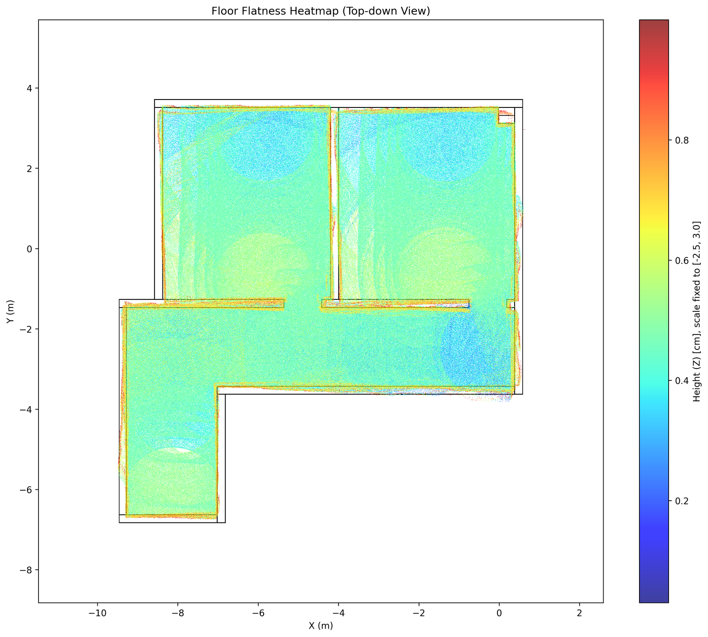
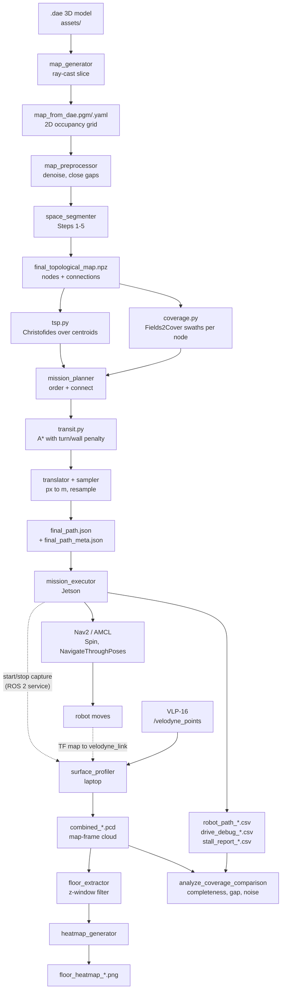
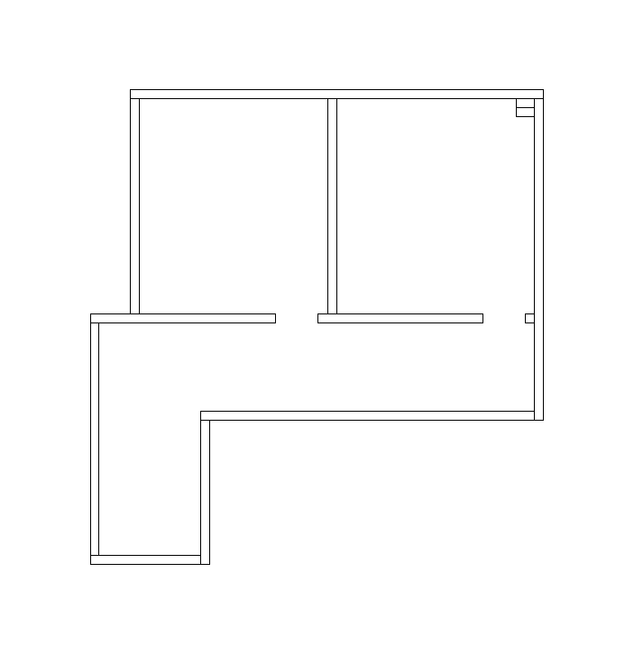
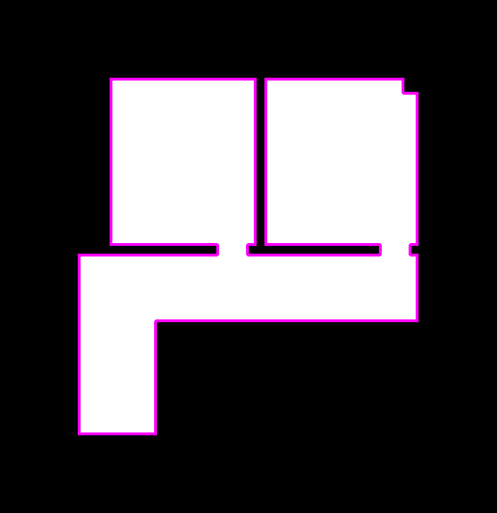
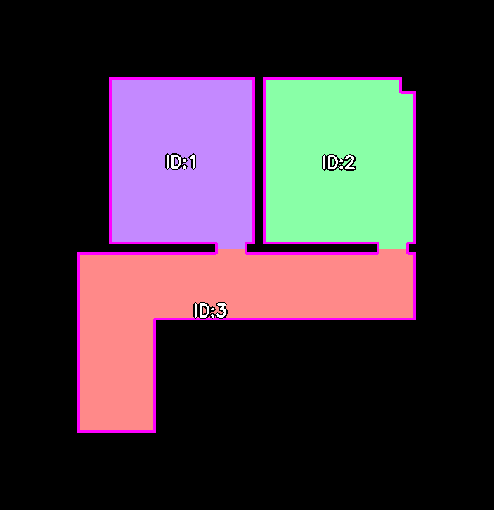
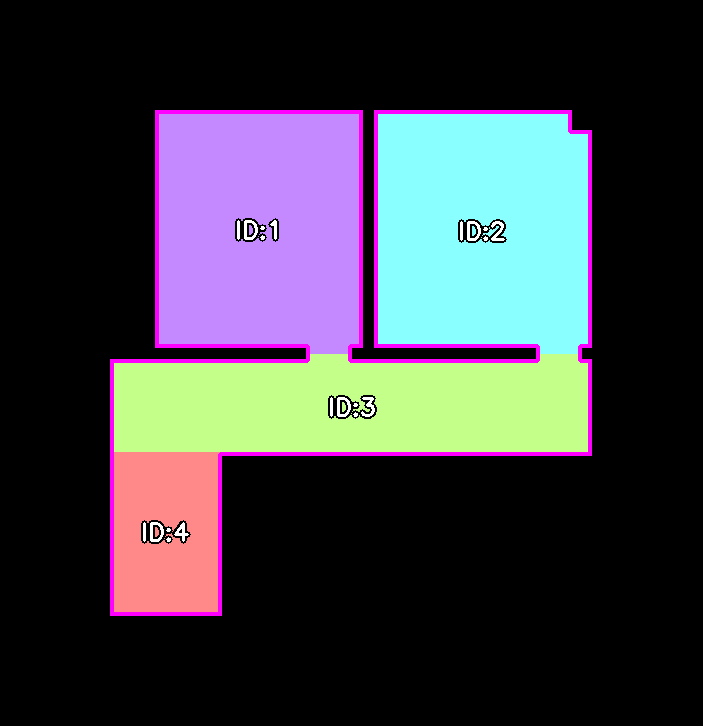
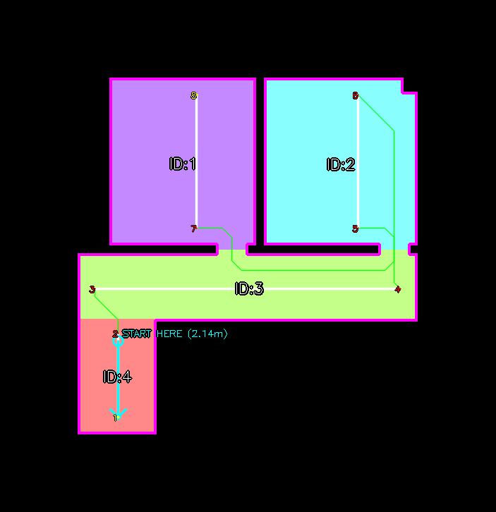
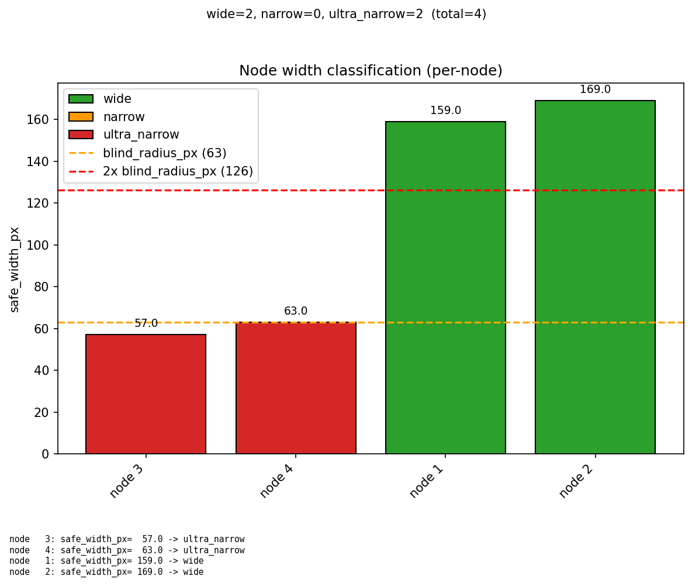
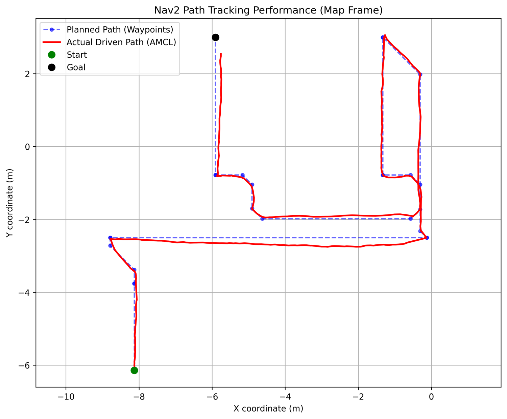
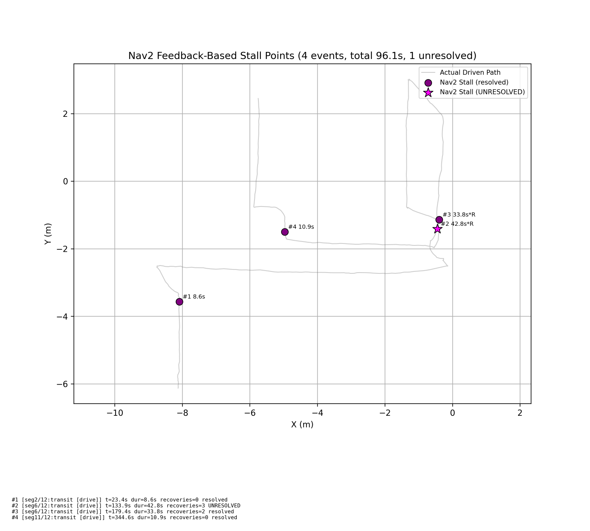

# DAE Coverage Floor Flatness

[](README.md)
[](README.kr.md)
[](https://docs.ros.org/en/humble/)
[](https://www.python.org/)
[](https://docs.nav2.org/)
[](#license)
[](#roadmap)

**Turn a building's 3D design file into a complete, autonomous floor-flatness survey. No human walks the floor.**

This package takes a `.dae` architectural model, converts it to a 2D map, decomposes the interior into room-level nodes, plans one offline coverage path that visits every square metre, drives it autonomously with ROS 2 / Nav2, and streams a 3D LiDAR point cloud of the floor into a millimetre-scale flatness heatmap.

<p align="center">
  <br>
  <em>End-to-end output: per-point floor height over the building footprint, 1&nbsp;cm analysis grid.</em>
</p>

---

## TL;DR

| | |
|---|---|
| **Problem** | Floor-flatness QA in multi-unit buildings is done by hand with a laser level. Cost scales linearly with the number of units, so it does not scale. |
| **Input** | One `.dae` (or BIM-exported) model of the floor plan. Nothing else: no prior SLAM run, no manual waypoints. |
| **Output** | A flatness heatmap, a filtered floor point cloud, the driven trajectory, and per-run coverage metrics. |
| **Approach** | Offline: DAE → 2D map → topological decomposition → TSP + Fields2Cover + A\* → a single waypoint file. Online: Nav2/AMCL follows it while a VLP-16 records the floor continuously. |
| **Scope** | Individual components (F2C, TSP, A\*, Nav2) are established. The contribution is integrating them **end-to-end** for construction QA, and isolating the contribution of each design choice through ablation. |

---

## Why this exists

Floor flatness is a contractual acceptance criterion at the finishing stage of construction. Two tools are in use today:

- **Line-laser profilometers** — lab-grade accuracy, but priced for smart factories. They are not deployed on ordinary residential sites.
- **Manual laser levels** — affordable and widely used. But a person has to carry the instrument from room to room, so **labour and time grow linearly with the number of units**.

In an apartment building with hundreds of near-identical units, that linear cost is the bottleneck. This project replaces the *workflow*, not the instrument: instead of a person walking each room, a robot drives a pre-computed coverage path through every room while a 3D LiDAR records the floor.

Because the floor plans repeat, the expensive part (planning) is done **once, offline, from the design file**, and reused for every unit.

## What it does

- **Reads the building, not the site.** A `.dae`/BIM model is converted to a 2D occupancy grid; no prior SLAM mapping run is needed.
- **Decomposes space the way a person would.** Doors, holes, concavity and corridor length split the interior into room-level nodes rather than arbitrary cells.
- **Plans full coverage offline.** TSP orders the rooms, Fields2Cover generates boustrophedon swaths inside each, A\* connects them. The result is a single `final_path.json`.
- **Checks reachability first.** Each node is classified by its traversable width against the LiDAR blind radius, and narrow rooms get a different swath strategy from wide ones.
- **Drives autonomously.** Nav2 + AMCL, with different controllers for measuring segments and for transit segments.
- **Measures while moving.** The LiDAR records continuously along coverage segments, not just at stop points, and the robot deliberately re-passes measurement boundaries to fill the sensor's blind cone.
- **Reports every run.** Every run emits the driven trajectory, stall diagnostics, coverage completeness, and a flatness heatmap.
- **Supports ablation.** Five independent optimizations are runtime toggles, so each one's contribution can be measured by leave-one-out.

## System overview

Three machines, three responsibilities:

| Role | Machine | Runs | Online? |
|---|---|---|---|
| **Planning** | Workstation / laptop (x86_64) | `run_generation_pipeline.py` | Offline, once per floor plan |
| **Driving** | Jetson Orin Nano on a TurtleBot3 Waffle | `mission_execution.launch.py` + Nav2 | Online |
| **Sensing** | Laptop, VLP-16 tethered over Ethernet | `surface_profiling.launch.py` | Online |

Routing VLP-16 clouds through the Jetson would compete with Nav2 for bandwidth, so sensing runs on the laptop the LiDAR is tethered to. They coordinate over three ROS 2 services (start capture / stop capture / mission finished) and share a timestamp so their outputs can be paired afterwards.

## Data flow



Everything the robot produces lands in an **external data store** (`~/dae_floor_maps`) that is deliberately kept outside the package, so the repository stays code-only:

```
~/dae_floor_maps/
├── assets/          # input .dae models
├── maps/            # grid/ (2D OGM), topology/ (nodes .npz), debug_image/
├── analytics/       # metrics/ (final_path.json), paths/ (driven .csv),
│                    # pointclouds/ (.pcd), logs/ (drive_debug, stall_report)
├── visualization/   # per-stage debug images and the flatness heatmap
└── eval_runs/       # per-experiment self-contained snapshots (optional)
```

---

## How it works

### Stage 1 — Environment modeling (offline)

The `.dae` mesh is sliced at floor level into a 2D occupancy grid, cleaned up, and then decomposed into nodes in five steps. Each step writes a debug image, so a bad decomposition is visible immediately rather than surfacing as a strange path later.

| | |
|---|---|
|  |  |
| **Input** — 2D grid generated from the `.dae` model. | **Step 1 — Physical limits.** Separate what the robot can drive on from what it cannot. Both remain measurement targets; only reachability differs. |
|  |  |
| **Step 2 — Door-based split.** Detect door-width openings and cut there, the way a person would call two sides "two rooms". Each opening is also checked for whether the robot can physically fit through it. | **Step 3 — Hole splitting.** Interior obstacles (columns, fixtures) make a node non-simply-connected; cut so each node stays coverable. |
|  |  |
| **Step 4 — Concavity split.** L-shaped corridors are recursively decomposed by solidity so boustrophedon swaths stay meaningful. | **Step 5 — Long-node subdivision.** Nodes past an aspect-ratio limit are cut for operational efficiency. |

Output: `final_topological_map.npz`. It holds node masks, centroids, and the connection points (doorways) between them.

### Stage 2 — Mission planning (offline)

<p align="center">
  
  <br>
  <em>Left: coverage swaths (white) and inter-node transit (green), with the required start pose marked. Right: the same path after distance-based resampling into the waypoints actually sent to Nav2.</em>
</p>

1. **Width classification.** Each node's safe traversable width is measured and bucketed as `wide`, `narrow`, or `ultra_narrow` against the LiDAR blind radius. This decides the coverage strategy per node and flags rooms the robot cannot enter at all.
2. **Visit order.** Christofides approximation (OR-Tools) over node centroids gives a global tour.
3. **Local reorder.** Rooms hanging off a hub corridor are re-ordered by door distance from the point where the robot actually finishes covering the hub.
4. **In-node coverage.** Fields2Cover generates boustrophedon swaths. Wide nodes get an automatic best-angle search; narrow nodes use a fixed angle.
5. **Swath ordering.** Swaths inside a node are ordered so the node is entered near its entry door and exited near the next room's door.
6. **Transit.** A\* between nodes with an explicit turn penalty and a wall-proximity penalty, then Douglas–Peucker simplification to remove the staircase artefacts of grid A\*.
7. **Export.** Pixel coordinates are converted to metres, resampled at a fixed spacing, and written as `final_path.json`, alongside `final_path_meta.json`, a sidecar recording the parameters actually used at planning time.

<p align="center">
  <br>
  <em>Node width distribution against the blind-radius thresholds that define the buckets.</em>
</p>

### Stage 3 — Mission execution (online, ROS 2 + Nav2)

`mission_executor` is a single `rclpy` node built from three mixins (`Nav2DriveMixin`, `LocalizationMixin`, `RunContextMixin`). It does **not** hand the whole path to Nav2 at once.

**Startup**
1. Read `final_path.json` and cross-check `final_path_meta.json` against the live `params.yaml`. The planned coordinates depend geometrically on the planning-time parameters, so the executor does not start if they differ.
2. Compute the physical start pose (a short run-up before the first coverage point), teleport the robot there in simulation, or use it as the AMCL initial pose on hardware, then wait for AMCL to converge.

**Per segment**
3. Re-split the path into straight sub-segments wherever heading changes by more than a threshold **or** the capture flag changes. Coverage and transit are never merged into one sub-segment.
4. For each sub-segment: rotate in place toward the next real waypoint → open the capture window if it is a measuring segment → `NavigateThroughPoses` to the end of the straight run → arrive.
5. At every coverage exit, run a **boundary repass** before closing the capture window (below).

**Nav2 integration.** Two controllers are registered and selected per action call by segment type (rationale in [Design choices](#design-choices)):

| | Coverage segments (measuring) | Transit segments (moving) |
|---|---|---|
| Controller plugin | `FollowPath` — RotationShim + DWB | `FollowPathTransit` — Regulated Pure Pursuit |
| Behavior tree | Nav2 default | `behavior_trees/navigate_{through_poses,to_pose}_transit.xml` |
| Linear speed | 0.16 m/s (validated for measurement quality) | 0.26 m/s (Waffle motor limit) |
| `RemovePassedGoals` radius | 0.7 m (Nav2 default) | 0.3 m |

The controller is chosen by `controller_id` inside the behavior tree, and the behavior tree is chosen per call via `goThroughPoses(poses, behavior_tree=...)`. Speed limits are swapped at runtime through `/controller_server/set_parameters`, so no restart is needed. If the transit BT files are missing, the executor falls back to Nav2's default BT rather than failing.

The costmap uses a **footprint polygon** taken from the URDF collision geometry rather than a circular `robot_radius` (rationale in [Design choices](#design-choices)).

<p align="center">
  <br>
  <em>Planned waypoints vs. the AMCL-estimated driven path, emitted automatically at the end of every run.</em>
</p>

### Stage 4 — Surface profiling (online, laptop)

`surface_profiler` subscribes to `/velodyne_points` and transforms every cloud into the map frame. Two details matter:

- **TF synchronisation.** `map→odom` from AMCL updates slower than the LiDAR publishes, so the TF at a cloud's exact stamp may not have arrived yet. `tf2_ros::MessageFilter` is C++-only, so the same behaviour is implemented with `Buffer.wait_for_transform_async`. Clouds are queued and processed once a TF covering their stamp actually arrives, without blocking the executor.
- **Frame low-pass filter.** Per-frame instantaneous linear and angular velocity is computed from consecutive transforms; frames above threshold (AMCL jumps, residual rotation) are dropped. The reference is only updated on frames that pass, so one bad frame cannot poison the next comparison.

Accumulated points are voxel-downsampled and saved as `combined_*.pcd` in the map frame. Floor extraction then keeps points inside a **z window spanning both sides** of the design floor level, and the heatmap renders height over a 1 cm grid with the 2D map overlaid.

`combined_*.pcd` is the archival artefact: every metric downstream (z window, grid pitch, completeness denominator) can be recomputed from it with `reprocess_pcd.py` or `analyze_coverage_comparison.py` **without re-driving the robot**.

---

## Design choices

Each entry is stated as *the condition under which the alternative is at a disadvantage → the choice made*. Items 1–5 are runtime toggles, so each contribution is measured separately by the leave-one-out ablation in [Evaluation](#evaluation).

### Path optimizations (toggles)

| # | Toggle | What it does | Rationale | Default |
|---|---|---|---|---|
| 1 | `enable_optimal_swath_angle` | Fields2Cover searches for the swath angle that minimises total swath length in wide nodes; when off, swaths are fixed at 0°. | In floor plans whose rooms are not axis-aligned, a fixed angle increases swath count and turning, so each node gets its own best angle. Narrow nodes fit a single swath and have no meaningful angle alternatives, so they are not searched. | `true` |
| 2 | `enable_pendant_reorder` | Re-orders rooms hanging off a hub corridor nearest-neighbour from the hub's *actual* coverage exit point. | TSP sees only centroid-to-centroid distance, which is a poor guide in long hub corridors where the coverage exit lies far from the centroid. Rooms are re-ordered from the real exit point instead. | `true` |
| 3 | `enable_entry_hint_ordering` | Orders swaths within a node so it is entered near the incoming door and left near the outgoing one. | Ordering swaths without regard to door positions forces the robot to cross a room again to leave it, so entry and exit doors are built into the order. | `true` |
| 4 | `enable_path_simplification` | Douglas–Peucker on A\* transit paths. | Grid A\* produces staircase paths in which every step is a heading change, needlessly multiplying sub-segments and in-place rotations. Simplification restores the straight runs. | `true` |
| 5 | `enable_boundary_repass` | At every coverage boundary, retrace a fixed distance back the way the robot came *with capture still on*, then stop recording. | A LiDAR mounted close to the ground has a blind cone directly beneath it, so the area near a boundary is not filled by a single one-way pass. The retrace secures a pass in both directions. | `true` |
| — | `coverage_mode` | `full` runs Fields2Cover swaths; `centroid_only` visits one point per room and captures while stopped. | `centroid_only` reproduces the manual laser-level workflow (sample representative points per room) as an evaluation baseline. | `full` |

### Driving and sensing structure

- **Per-segment controllers.** Measuring segments need repeatable, speed-stable tracking of the swath; transit segments need smooth, continuously regulated motion through doorways and corners. A single controller is poorly suited to both, so measurement uses RotationShim + DWB and transit uses Regulated Pure Pursuit, which tracks the planned path directly. The transit BT's `RemovePassedGoals` radius is reduced to 0.3 m for the same reason. Via-points in front of a doorway must not be discarded before they are reached, or the planned passage shape is lost.
- **Polygon footprint.** The Waffle's collision box is offset behind the rotation centre and its wheels protrude sideways, which a circular `robot_radius` cannot represent at the rear corners. A polygon taken from the URDF collision geometry is used instead.
- **Rotation aim point.** The last point of a sub-segment can point past a doorway, which makes it a poor aim target in front of one. The in-place rotation aims at the **first** waypoint at least `rotate_aim_min_dist_m` away.
- **Capture window scope.** A capture window opens when a node's coverage starts, stays open through corners inside the node, and closes after the boundary repass. Transit between nodes runs faster than the speed validated for measurement quality, so it is not recorded.
- **Pinned planning parameters.** With planning and execution on different machines, a configuration drift between them is not visible in the path coordinates alone. `final_path_meta.json` records the planning-time values and the executor checks them against its configuration at startup.

### Failure handling during a run

Following an offline plan with a reactive local planner can produce stalls that neither the planner nor Nav2 resolves on its own. The executor detects and escalates them itself:

- **Stall watchdog.** In case Nav2 recovery repeats without progress, the executor tracks progress independently and cancels the action after `nav_stuck_cancel_sec` without movement.
- **Three-stage escalation.** After a cancel: (1) retry the Nav2 action, (2) back up a few centimetres and retry (near a wall, the `Spin` pre-collision check can reject an in-place rotation), (3) publish `/cmd_vel` directly for a short, slow, distance-bounded move, guarded by an AMCL-jump check and a hard timeout. Single-goal drives use stages 1–2 only.
- **Per-run diagnostics.** Every run writes `drive_debug_*.csv` (periodic pose, active action, progress metric, recovery count) while driving and `stall_report_*.csv` afterwards, and renders stall locations onto the driven path.

<p align="center">
  <br>
  <em>Stall diagnostics: each stall is localised on the driven path and annotated with its duration, segment, and whether Nav2's own recovery resolved it.</em>
</p>

## Repository structure

```
dae_coverage_floor_flatness/
├── config/
│   ├── params.yaml                    # all algorithm + execution parameters
│   └── tb3_waffle_nav2_params.yaml    # Nav2 stack (costmaps, controllers, BT paths)
├── behavior_trees/                    # transit-only BTs that select the RPP controller
├── launch/                            # sim + real bringup, Nav2, and the two pipeline nodes
├── mission_generation/                # OFFLINE
│   ├── run_generation_pipeline.py     # one-shot: modeling -> planning
│   ├── environment_modeling/          # dae -> 2D map -> node decomposition
│   │   └── algorithms/                # limits, doors, holes, convexity, subdivider
│   └── mission_planning/              # visit order, coverage, transit, export
│       ├── mission_planner.py         # orchestration
│       ├── path_exporter.py           # px -> m, resample, write json
│       ├── algorithms/                # tsp, coverage (F2C), transit (A*), pendant_reorder
│       └── utils/                     # geometry, sampler, visualizer, repass_preview
├── mission_execution/                 # ONLINE (Jetson)
│   ├── mission_executor.py            # mission flow
│   ├── nav2_drive_mixin.py            # Nav2 action wrappers + stall escalation
│   ├── localization_mixin.py          # AMCL init, jump detection, TF lookup
│   ├── run_context_mixin.py           # config/path loading, result saving
│   └── utils/                         # boundary_repass, controller_switch, loggers
├── surface_profiling/                 # ONLINE (laptop)
│   ├── surface_profiler.py            # collection -> floor extraction -> heatmap
│   ├── tf_sync_mixin.py               # TF-cloud synchronisation + low-pass filter
│   ├── capture_services_mixin.py      # capture/stop trigger services
│   ├── reprocess_pcd.py               # re-run post-processing on a stored .pcd
│   ├── analyze_coverage_comparison.py # per-run metrics CLI
│   └── utils/                         # floor_extractor, heatmap_generator, coverage_metrics
├── models/ urdf/ worlds/ rviz/        # self-contained sim + real robot description
└── requirements-*.txt                 # pinned dependencies per role
```

TurtleBot3 description, Nav2 parameters, Gazebo worlds and models are **vendored into this package** so a simulation or a real run needs only this repository plus the stock ROS 2 / Nav2 stack.

## Installation

Full, machine-by-machine instructions: **[docs/en/installation.md](docs/en/installation.md)** ([한국어](docs/kr/installation.md)).

Short version. Steps 1–2 run on every machine taking a [planning/driving/sensing](#system-overview) role; step 3 is one line per role, on that role's machine only:

```bash
# 1. External data store (kept outside the repo)
mkdir -p ~/dae_floor_maps/{assets,maps/{debug_image,grid,topology},\
analytics/{metrics,paths,pointclouds,logs},\
visualization/{mission_generation/{environment_modeling,mission_planning},mission_execution,surface_profiling}}
# put your .dae model in ~/dae_floor_maps/assets/

# 2. Workspace
mkdir -p ~/ros2_ws/src && cd ~/ros2_ws/src
git clone https://github.com/ChanggonSong/dae-coverage-floor-flatness.git
cd ~/ros2_ws
rosdep install --from-paths src --ignore-src -r -y
colcon build --symlink-install && source install/setup.bash

# 3. Role-specific Python dependencies - planning machine runs the first line only,
#    sensing machine (the laptop wired to the VLP-16) runs the second line only
cd ~/ros2_ws/src/dae-coverage-floor-flatness
pip install -r requirements-mission_generation.txt   # planning role
pip install -r requirements-surface_profiling.txt    # sensing role
```

> **Fields2Cover must be built from source at a pinned commit** (`85d6cf7`), not installed from PyPI. Different F2C versions produce different swath geometry, which changes the node visit order and makes results non-comparable across machines. See the installation guide.

## Run order

Run each command in a new terminal, **in the order shown**. Later steps consume TF, topics and services from earlier ones, so a different order can silently drop data rather than raise an error.

**Simulation** (one machine):

```bash
# 0. Generate the path - once per floor plan; re-run after changing path-related parameters
cd ~/ros2_ws/src/dae-coverage-floor-flatness/mission_generation
python3 run_generation_pipeline.py

# 1. Gazebo world + robot
ros2 launch dae_coverage_floor_flatness sim_env.launch.py

# 2. Nav2 + AMCL
ros2 launch dae_coverage_floor_flatness tb3_waffle_nav2.launch.py use_sim_time:=true

# 3. Floor measurement node
ros2 launch dae_coverage_floor_flatness surface_profiling.launch.py is_sim:=true

# 4. Mission execution - always last
ros2 launch dae_coverage_floor_flatness mission_execution.launch.py is_sim:=true
```

**Real robot** (three machines; synchronise the Jetson and laptop clocks, e.g. with chrony, beforehand):

> **Place the robot at the start pose before running any of this.** On hardware `mission_executor` only injects the computed start pose as the AMCL initial estimate. If the robot is not physically there, the run begins from a wrong position.
>
> `visualization/mission_generation/mission_planning/full_mission_path.png` from the planning stage marks that pose with its heading (red arrow) and the distance to the nearest wall in centimetres. Measure that distance with a tape and align the robot along the arrow. Heading matters more than position: an initial heading error is baked into the `map→odom` transform and leaves the whole run looking skewed.

```bash
# 0. [Planning machine] Generate the path, then copy ~/dae_floor_maps to the same location on the robot (Jetson)
python3 run_generation_pipeline.py

# 1. [Jetson] Robot bringup
ros2 launch dae_coverage_floor_flatness real_bringup.launch.py

# 2. [Jetson] Nav2 + AMCL
ros2 launch dae_coverage_floor_flatness tb3_waffle_nav2.launch.py use_sim_time:=false

# 3. [Laptop] VLP-16 driver - confirm with `ros2 topic hz /velodyne_points` before moving on
ros2 launch velodyne velodyne-all-nodes-VLP16-launch.py

# 4. [Laptop] Floor measurement node
ros2 launch dae_coverage_floor_flatness surface_profiling.launch.py is_sim:=false

# 5. [Jetson] Mission execution - always last
ros2 launch dae_coverage_floor_flatness mission_execution.launch.py is_sim:=false
```

Why the order matters:

| Order | Reason |
|---|---|
| Path generation → mission execution | The executor reads `final_path.json` once at startup. A regenerated path takes effect only after the executor is restarted. |
| Robot → Nav2 | Nav2 and AMCL consume the TF and `/scan` published by the robot. |
| Measurement node → mission execution | If the measurement node is absent, the executor's capture start/stop requests log a warning and driving continues. In the wrong order the mission completes normally but the point clouds of the first nodes are missing. |
| Mission execution last | On startup the executor places the robot at the start pose (teleport in simulation, AMCL initial pose on hardware) and begins driving immediately. |
| Clock sync (real robot) | The measurement node looks up the TF at each cloud's stamp; if the two machines' clocks disagree, clouds cannot be transformed and are dropped. |

To keep each experiment's artefacts separate, pass the same `eval_run_label:=<name>` to both launches; to make both machines stamp their files with one timestamp, pass the same `run_ts:=<YYYY-MM-DD_HH-MM-SS>` (see [Reproducibility](docs/en/evaluation.md#reproducibility)).

Re-analyse a stored run without re-driving:

```bash
cd surface_profiling
python3 reprocess_pcd.py combined_<timestamp>.pcd --z-min -0.03 --z-max 0.03
python3 analyze_coverage_comparison.py combined_<timestamp>.pcd \
    --robot-path robot_path_<epoch>.csv --stall-report stall_report_<epoch>.csv
```

## Configuration

All settings live in [`config/params.yaml`](config/params.yaml), grouped by pipeline stage. The most frequently edited parameters and the values that are easy to get wrong are covered in the [configuration guide](docs/en/configuration.md).

## Evaluation

The contribution of each of the five optimizations is isolated by leave-one-out ablation (9 configurations, *n* ≥ 4 runs each). Metric definitions, configurations and reproducibility measures are described in the [evaluation protocol](docs/en/evaluation.md).

> **Result figures are not included in this repository.**

## Hardware

| Component | Used here | Notes |
|---|---|---|
| Mobile base | TurtleBot3 Waffle | Differential drive, no reverse in normal operation |
| Onboard compute | Jetson Orin Nano (arm64) | Runs Nav2 + `mission_executor` |
| 2D LiDAR | LDS-02 | AMCL localisation only |
| 3D LiDAR | Velodyne VLP-16 | Floor measurement; tethered by Ethernet to the laptop, not to the Jetson |
| Offboard compute | x86_64 laptop | Path generation and point-cloud processing; CUDA optional |

The full pipeline also runs entirely in Gazebo with no hardware, which is how the ablation study is executed.

## Roadmap

- [ ] Collect the full ablation matrix (9 configurations × *n* ≥ 4) and publish the results table.
- [ ] Quantify effective measurement error against the VLP-16 datasheet specification, including the improvement from multi-scan overlap.
- [ ] Validate the pipeline on a second, structurally different floor plan.
- [ ] Long-duration real-hardware validation of the per-segment controller setup (DWB + RPP).

## Citation

Please cite the software:

```bibtex
@software{song_dae_coverage_floor_flatness,
  author  = {Song, Changgon},
  title   = {{DAE Coverage Floor Flatness}: Autonomous Floor Flatness
             Measurement via Design-File-Driven Coverage Path Planning},
  year    = {2026},
  url     = {https://github.com/ChanggonSong/dae-coverage-floor-flatness},
  version = {0.1.0}
}
```

## License

Copyright © 2026 Changgon Song. All rights reserved.

No open-source license is granted for this repository. The code and documentation may not be copied, modified or redistributed without prior written permission from the copyright holder.

The files below are derived from files by ROBOTIS and the Open Source Robotics Foundation and remain under the Apache License 2.0 (full text: [`LICENSES/Apache-2.0.txt`](LICENSES/Apache-2.0.txt)). Each was modified for this package, and the original headers are kept wherever the originals had them.

- `launch/`: `real_bringup`, `real_robot_state_publisher`, `sim_env`, `sim_robot_state_publisher`, `sim_spawn_robot`, `tb3_waffle_nav2`
- `urdf/turtlebot3_waffle.urdf.xacro`, `urdf/turtlebot3_waffle.gazebo.xacro`
- `config/tb3_waffle_nav2_params.yaml`, `rviz/tb3_navigation2.rviz`

The Apache License does not apply to any other file in this repository.

## Acknowledgments

- [Nav2](https://docs.nav2.org/) — navigation stack, behavior trees, and the Regulated Pure Pursuit controller.
- [Fields2Cover](https://github.com/Fields2Cover/Fields2Cover) — coverage path generation.
- [OR-Tools](https://developers.google.com/optimization) — TSP solver.
- [TurtleBot3](https://github.com/ROBOTIS-GIT/turtlebot3) — robot platform and description files.
- [Open3D](https://www.open3d.org/) — point-cloud processing.
